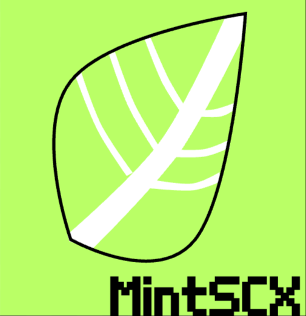

# MintSCX🌿
MintSCX is a Scratch "framework" that provides basic tools that make your project:  

  • More abstract: It helps you understand better what you are coding.  
  • More Efficient: Helps you save blocks and, because of that, more space for your program.  

  

# This is still on development ⚠️
it is not released. this is a preview of what it'll be.
